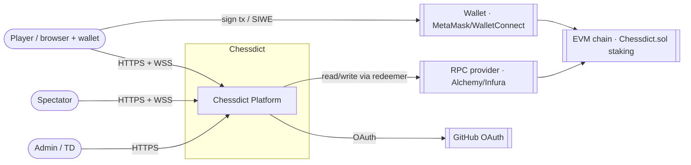
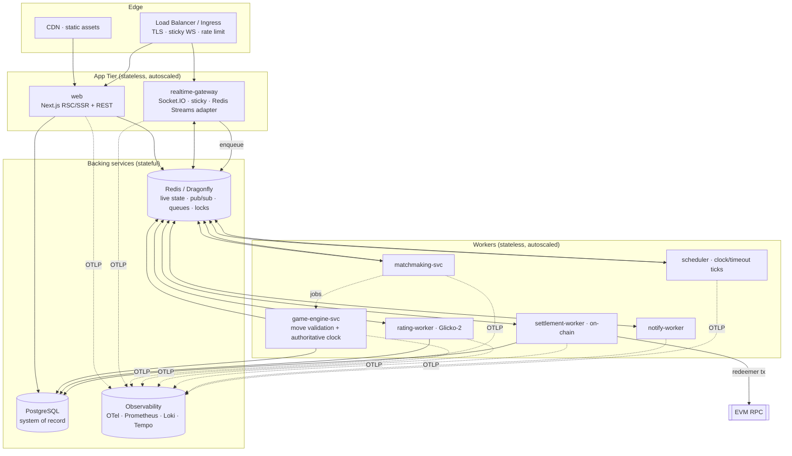
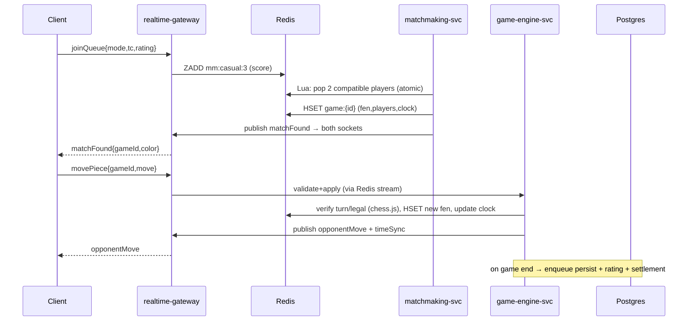

# 00 — System Overview & High-Level Architecture

> **Audience:** everyone. Read this first. It explains *why* the rebuild is shaped the way it is and
> gives you the mental model to navigate every other document.
>
> **Diagrams:** [system-context.drawio](../diagrams/system-context.drawio) ·
> [container-architecture.drawio](../diagrams/container-architecture.drawio)

---

## 1. Why the first build fell over

A load test of "a couple dozen users" broke the app. This was not bad luck — it was structural. The
entire backend is a single **4,794-line `server.mjs`** that keeps *authoritative* state in the memory
of one Node.js process:

```js
// server.mjs — state that only exists inside ONE process
const userSocketMap   = new Map(); // userId -> socketId
const activeGames     = new Map(); // socketId -> roomId
const gameTimers      = new Map(); // roomId  -> { whiteTime, blackTime, timeoutHandle }
const stakeTimeouts   = new Map();
const gameStateStore  = new Map(); // roomId  -> { fen, moves[] }
// ...plus matchmaking queues held in lib/matchmaking.mjs closures
```

Consequences:

| Symptom the team saw | Structural cause |
| --- | --- |
| App dies under light load | One process does socket I/O **and** chess validation **and** timers **and** DB writes **and** on-chain calls. CPU saturates; the event loop stalls; timers drift. |
| "Can't just add another server" | State lives in process memory. A second instance has its own `Map`s, so a player on instance B is invisible to their opponent on instance A. The Socket.IO Redis adapter only fans out *messages*, not *state*. |
| Matchmaking flaky | Queues are in-memory closures in `lib/matchmaking.mjs` — single-instance only. |
| Clocks drift / games hang | Timers are per-process `setTimeout`; a restart or deploy loses every live clock. |
| Staked games occasionally strand funds | `settleStakedGame()` is fire-and-forget with no retry, no idempotency, no queue. |
| Merge pain & bugs | The God file plus 2,000-line React components (`game-board.tsx`) means every dev edits the same hotspots with different LLMs and no shared pattern. |

**The fix is not "optimize `server.mjs`." It is to make every tier stateless and push state into
shared infrastructure (Redis + Postgres) so we can run many copies of each tier.** That is the whole
game plan for reaching 10,000 CCU.

---

## 2. Design principles (non-negotiable)

1. **Stateless services, shared state.** No authoritative state in process memory. Live state → Redis;
   system of record → Postgres. Any instance can serve any request.
2. **Separate the workloads.** Connection handling, CPU-bound chess logic, scheduling, and blockchain
   I/O have different scaling and failure profiles. They become separate, independently scalable
   services.
3. **Event-driven, queue-backed.** Slow/failable work (settlement, rating updates, persistence,
   notifications) runs on **BullMQ** queues with retries, backoff, and idempotency — never inline in
   the hot path.
4. **Authoritative server, thin client.** The server owns the clock and the legal-move truth. Clients
   render and predict; they never decide outcomes. (Prevents cheating on a money app.)
5. **Horizontal-first.** Everything scales *out* (more instances) before *up* (bigger instances).
6. **Fail safe, degrade gracefully.** Redis blip must not corrupt a game; a chain-RPC outage must not
   lose a payout — it queues and retries.
7. **One documented pattern per concern.** No parallel ways to do the same thing. LLM guides enforce it.

---

## 3. System context (who talks to Chessdict)



See [system-context.drawio](../diagrams/system-context.drawio) for the presentation-quality version.

---

## 4. Target container architecture

The monolith splits into the services below. **Every box scales horizontally.** Boxes are grouped by
plane: *edge*, *stateless app tier*, *workers*, *stateful backing services*.



See [container-architecture.drawio](../diagrams/container-architecture.drawio) for the detailed version
with ports, replica counts, and data-store keys.

### Service catalog

| Service | Responsibility | Stateless? | Scales on | Key tech |
| --- | --- | --- | --- | --- |
| **web** | UI, RSC/SSR, REST/route handlers, server actions, auth | Yes | CPU / RPS | Next.js 16, React 19 |
| **realtime-gateway** | WebSocket transport only: auth handshake, room join, relay events to/from Redis & queues. **No game logic.** | Yes (sticky sessions) | CCU / socket count | Socket.IO 4.8 + `@socket.io/redis-streams-adapter` |
| **matchmaking-svc** | Pop compatible players from Redis pools, create games | Yes | queue depth | Node + Redis sorted sets + Lua |
| **game-engine-svc** | Validate moves (chess.js), mutate authoritative game state in Redis, detect end conditions, persist finished games | Yes | active games / moves-per-sec | Node + chess.js |
| **scheduler** | Fire clock timeouts, first-move-abort, disconnect-grace, challenge expiry | Yes (leader-elected per shard) | timers | BullMQ delayed jobs + Redis |
| **rating-worker** | Glicko-2 updates after each game | Yes | games/min | Node |
| **settlement-worker** | Idempotent on-chain `setWinnerSingle` with nonce mgmt + retry | Yes (nonce-serialized per signer) | staked games/min | ethers v6 + BullMQ |
| **notify-worker** | Fan-out notifications (email/push/in-app) | Yes | events/min | Node |

> **Why split `realtime-gateway` from `game-engine-svc`?** Socket handling is I/O-bound and needs many
> lightweight instances close to users. Move validation is CPU-bound and bursty. Splitting lets each
> scale on its own signal and stops a validation spike from stalling socket heartbeats (the exact
> failure mode that killed the monolith).

---

## 5. Where state lives (the most important table in this repo)

| Data | Store | Structure | Lifetime |
| --- | --- | --- | --- |
| Live game (FEN, moves, clock, players) | **Redis** | Hash `game:{id}` + list `game:{id}:moves` | Game duration (+4 h TTL) |
| Player ↔ socket ↔ instance mapping | **Redis** | Hash `presence:{userId}` | Session |
| Matchmaking pools | **Redis** | Sorted set `mm:{mode}:{tc}` (score = rating/enqueue time) | Until matched |
| Authoritative clock deadline | **Redis** + scheduler | `clock:{gameId}` + delayed job | Per turn |
| Distributed locks (settlement, match-create) | **Redis** | `SET NX PX` / Redlock | Seconds |
| Queues (settlement, ratings, notify) | **Redis** | BullMQ streams | Until processed |
| Users, finished games, tournaments, ratings | **PostgreSQL** | Prisma models | Permanent |
| On-chain stakes & payouts | **EVM chain** | `Chessdict.sol` | Permanent |

Rule of thumb: **if two services or two instances need to agree on it, it goes in Redis or Postgres —
never a JavaScript `Map`.**

---

## 6. Key end-to-end flows

### 6.1 Casual game — find match → play a move



Full detail: [02-realtime-gameplay.md](./02-realtime-gameplay.md),
[03-matchmaking.md](./03-matchmaking.md), [04-game-engine-state.md](./04-game-engine-state.md).

### 6.2 Staked game settlement (money path — must never lose funds)

```mermaid
sequenceDiagram
    participant ENG as game-engine-svc
    participant Q as BullMQ (Redis)
    participant SET as settlement-worker
    participant CH as Chessdict.sol

    ENG->>ENG: game ends, winner known
    ENG->>Q: enqueue settle{gameId,winner,idempotencyKey}
    SET->>SET: acquire signer-nonce lock
    SET->>CH: setWinnerSingle(gameId,winner,isDraw)
    CH-->>SET: tx receipt
    SET->>SET: mark settled (idempotent); on fail → backoff retry
```

Full detail: [06-blockchain-settlement.md](./06-blockchain-settlement.md).

---

## 7. Capacity model — sizing for 10,000 CCU (minimum)

Assumptions from a chess product: at 10k CCU roughly **50% are in a live game** (5,000 players ≈ 2,500
games), ~30% browsing, ~20% spectating. Blitz/bullet games peak around **1 move/sec/active player**,
so worst-case ≈ **5,000 moves/sec** platform-wide; realistic sustained ≈ 1,500–2,500 moves/sec.

| Tier | Load driver | Per-instance capacity (conservative) | Instances @ 10k CCU | Instances @ 20k burst |
| --- | --- | --- | --- | --- |
| realtime-gateway | ~10k sockets/instance (2 vCPU/2 GB, tuned) | 10,000 sockets | **2–3** (headroom + HA) | 4–5 |
| web (RSC/SSR/REST) | ~800–1,200 RPS/instance | browse+API traffic | **3–4** | 6–8 |
| game-engine-svc | ~3–5k move-validations/sec/instance | 2,500 moves/sec | **2** | 3–4 |
| matchmaking-svc | thousands of pops/sec | bursty | **2** (HA) | 2–3 |
| scheduler | tens of thousands of timers | Redis-backed | **2** (HA, sharded) | 2–3 |
| rating/settlement/notify workers | queue-driven | elastic | **2 each** | 3–4 each |
| Redis / Dragonfly | ~1–2 M ops/sec (Dragonfly) | central | **1 primary + replica** (or cluster) | cluster 3 shards |
| PostgreSQL | writes only on game-end/matches | 1 primary + 1–2 read replicas | **1+1** | 1+2 |

Takeaways:

- **10k CCU is a small cluster** once state is externalized — roughly 12–18 small containers plus
  managed Redis and Postgres. The problem was never the traffic; it was the un-scalable shape.
- Redis is the throughput hotspot. Use **Dragonfly** (drop-in Redis, multi-threaded, far higher
  ops/sec/node) or Redis Cluster. Keep it in the **same region/VPC** as the services.
- Postgres is *not* on the hot path (moves live in Redis), so a single primary + read replicas is
  plenty. Batch game-end persistence through a queue.

Detailed math and autoscaling rules: [deployment/01-scaling-playbook.md](../deployment/01-scaling-playbook.md).

---

## 8. Technology decisions (summary)

| Concern | Choice | Why (short) | Detail |
| --- | --- | --- | --- |
| Web framework | **Next.js 16 (App Router) + React 19** | Keep; already in use; great RSC/edge story | [01](./01-frontend.md) |
| Realtime | **Socket.IO 4.8 + Redis Streams adapter**, sticky sessions | Keep protocol; fix the state; Streams adapter scales fan-out better than Pub/Sub | [02](./02-realtime-gameplay.md) |
| Live state / cache / locks / queues | **Redis 7** (managed) or **Dragonfly** self-host | One dependency for state, pub/sub, queues, locks | [07](./07-data-layer.md) |
| Job queues | **BullMQ** | Mature, Redis-native, retries/backoff/rate-limit/delayed jobs | [06](./06-blockchain-settlement.md) |
| System of record | **PostgreSQL + Prisma 6** | Keep; strong typing; migrations already exist | [07](./07-data-layer.md) |
| Chess rules | **chess.js** (server-authoritative) | Keep; battle-tested; must run on server not client | [04](./04-game-engine-state.md) |
| Ratings | **Glicko-2** | Keep; correct for sparse play; already partially built | [05](./05-ratings.md) |
| Auth | **SIWE + NextAuth v5** (JWT sessions) | Wallet-native; stateless sessions scale | [08](./08-auth-identity.md) |
| Contracts | **Solidity + Foundry**, outbox settlement | Keep contract; fix the off-chain settlement path | [06](./06-blockchain-settlement.md) |
| Observability | **OpenTelemetry → Prometheus / Loki / Tempo (+ Sentry)** | Vendor-neutral; free self-host or Grafana Cloud | [10](./10-observability.md) |
| Deploy target | **Fly.io or Railway/Render** (primary), **AWS ECS Fargate** (scale-up) | Regional sticky WS, cheap, container-native | [deployment](../deployment/00-deployment-guide.md) |
| Managed Postgres | **Neon** (serverless) or **Supabase** | Branching, autoscale, cheap at this scale | [deployment](../deployment/00-deployment-guide.md) |
| Managed Redis | **Upstash** (start) → **Dragonfly Cloud / ElastiCache** (scale) | Pay-per-use → dedicated as CCU grows | [deployment](../deployment/00-deployment-guide.md) |

---

## 9. What "done" looks like

- No authoritative state in any process `Map`/`Set`. Kill any instance → games continue.
- Deploy with zero dropped games (clients auto-reconnect and resync from Redis).
- Load test passes **10,000 CCU / 2,500 concurrent games** with p95 move latency < 120 ms.
- Every staked game settles exactly once, even across RPC outages and redeploys.
- A new engineer (or LLM) can ship a correct feature by reading only the relevant doc here.

Next: read the doc for the area you're working on (links at the top of
[docs/README.md](../README.md)).
