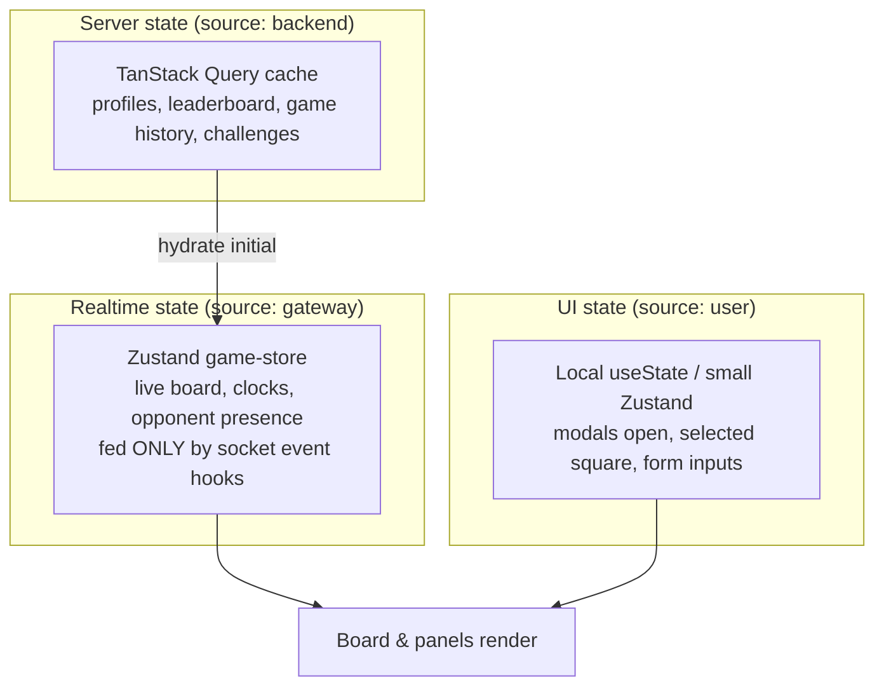

# 01 — Frontend Architecture (web)

> **Scope:** the Next.js application — UI, client state, data fetching, wallet UX, and how the browser
> talks to the realtime gateway. **Governing instruction file:**
> [`.github/instructions/frontend.instructions.md`](../../.github/instructions/frontend.instructions.md).

---

## 1. Problems in the current frontend

| Problem | Evidence | Consequence |
| --- | --- | --- |
| God components | `game-board.tsx` = **2,022 lines**, `game-info-panel.tsx` = 1,302, `public-game-spectator.tsx` = 909 | Every dev edits the same file → merge conflicts, regressions |
| Mixed responsibilities | Board rendering + socket handling + clock + modals + chain calls in one component | Impossible to test or reason about |
| Ad-hoc socket usage | Components call `socket.on(...)` directly | Duplicated listeners, leaks, race conditions |
| Blurred state ownership | Server state, socket state, and UI state all in `useState`/Zustand | Stale data, double sources of truth |

## 2. Goals

- No component over **~300 lines**. One responsibility each.
- **Three clearly separated kinds of state** (below), each with one owner.
- All realtime access goes through **typed hooks**, never raw `socket.on` in components.
- Feature-first folders so a feature is self-contained and ownable by one person.

## 3. Technology

| Concern | Choice | Notes |
| --- | --- | --- |
| Framework | **Next.js 16 App Router**, React 19 | Keep. Use Server Components for data-heavy read pages (leaderboard, profile, chessdicts). |
| Styling | **Tailwind CSS 4** + `class-variance-authority` | Keep. Design tokens in `globals.css`. |
| Primitives | **Radix UI** (via shadcn pattern) in `components/ui/` | Keep. Never hand-roll modals/toasts. |
| Client global state | **Zustand** (`stores/`) | UI/session state only — never server data. |
| Server state / caching | **TanStack Query v5** | All REST reads; retries, dedupe, cache. |
| Forms & validation | **React Hook Form + Zod** | Zod schemas shared with the server. |
| Realtime | **socket.io-client** wrapped in hooks | One singleton connection (already the pattern in `useSocket`). |
| Wallet | **wagmi + viem + RainbowKit** | Keep. Isolate all chain calls in `hooks/useChessdict.ts` + `lib/chain/`. |
| Board | **react-chessboard + chess.js** | chess.js on the client is for **rendering/legal-move hints only**; the server is authoritative. |
| Animation | **Framer Motion** | Keep, but lazy-load heavy animations. |
| Notifications | **sonner** | `toast(...)`; never `alert()`. |

## 4. The three kinds of state (memorize this)



| Kind | Owner | Tool | Rule |
| --- | --- | --- | --- |
| **Server state** | Backend | TanStack Query | Never copy into Zustand. Read via `useQuery`. Mutations via `useMutation` + invalidate. |
| **Realtime state** | Gateway | Zustand `game-store` | Written **only** by realtime hooks (`useGameSocket`). Components read, never write raw. |
| **UI state** | User | `useState` / tiny Zustand | Never persists business truth. |

## 5. Target folder structure (feature-first)

```
src/
  app/                      # routes only — thin; delegate to features/
    (marketing)/page.tsx
    play/…                  # route shells that mount feature components
    leaderboard/page.tsx    # Server Component: fetch on server
    api/                    # route handlers (REST) — see 02/07
  features/                 # ← NEW: feature-first modules
    gameplay/
      components/           # board, clock, move-list, controls (each <300 lines)
        board.tsx
        board-square.tsx
        clock.tsx
        move-list.tsx
        game-controls.tsx
        promotion-dialog.tsx
      hooks/
        use-game-socket.ts  # subscribes to gateway, writes game-store
        use-game-clock.ts
        use-premove.ts
      store/game-store.ts
      lib/board-math.ts     # pure helpers (algebraic <-> coords)
      types.ts
    matchmaking/
    staking/                # all chain interactions live here
    tournaments/
    profile/
    leaderboard/
  components/ui/            # shared Radix/shadcn primitives (keep)
  lib/
    api/                    # typed REST client + Zod response schemas
    chain/                  # viem clients, ABI, contract read/write wrappers
    realtime/               # socket singleton + typed event contracts
    utils.ts
  hooks/                    # cross-feature hooks (useBoardTheme, useChessSounds)
  stores/                   # cross-feature stores only
```

**How to break up `game-board.tsx` (2,022 lines):** extract `clock.tsx`, `move-list.tsx`,
`game-controls.tsx`, `promotion-dialog.tsx`, `board-square.tsx`; move every `socket.on` into
`use-game-socket.ts`; move clock math into `use-game-clock.ts`; move algebraic/coord helpers into
`lib/board-math.ts` (pure, unit-tested). The board component then only renders and dispatches intents.

## 6. Realtime integration pattern (the one true way)

Components must **never** call `socket.on`. One hook per concern owns the subscription and writes the
store:

```ts
// features/gameplay/hooks/use-game-socket.ts
export function useGameSocket(gameId: string) {
  const socket = useSocket();                 // shared singleton
  const apply = useGameStore((s) => s.applyServerEvent);

  useEffect(() => {
    if (!socket) return;
    const onMove = (p: OpponentMove) => apply({ type: "move", ...p });
    const onClock = (p: TimeSync) => apply({ type: "clock", ...p });
    const onOver = (p: GameOver) => apply({ type: "over", ...p });
    socket.on("opponentMove", onMove);
    socket.on("timeSync", onClock);
    socket.on("gameOver", onOver);
    socket.emit("joinRoom", { gameId });
    return () => {
      socket.off("opponentMove", onMove);
      socket.off("timeSync", onClock);
      socket.off("gameOver", onOver);
    };
  }, [socket, gameId, apply]);
}
```

Event names and payloads come from a **shared contract** (`lib/realtime/contracts.ts`) that is
generated from / matched to the gateway's Zod schemas — see
[02-realtime-gameplay.md](./02-realtime-gameplay.md#event-contract). This is what keeps four devs and
their LLMs from inventing divergent event shapes.

### Client-side move: optimistic but not authoritative

1. User drags a piece. Client validates *locally* with chess.js for instant feedback (illegal → snap
   back, no round trip).
2. Client optimistically renders the move and `emit("movePiece", …)`.
3. Server validates authoritatively. On `opponentMove`/`timeSync` the store **reconciles** to server
   truth. On rejection (`moveRejected`) it rolls back. The server clock is always the display truth.

## 7. Data fetching

- **Read-heavy pages** (leaderboard, profile, chessdicts, game history) → **React Server Components**;
  fetch on the server, stream HTML, no client waterfall.
- **Interactive client data** → TanStack Query against REST route handlers with `staleTime` tuned per
  resource (leaderboard 30 s, profile 60 s).
- **Mutations** → `useMutation` → invalidate affected query keys. No manual cache surgery.

## 8. Performance budget (matters at 10k CCU on the client too)

| Rule | Why |
| --- | --- |
| Route-level code splitting; lazy-load board, tournament bracket, charts | Smaller TTI on `/play` |
| Memoize board squares; render only changed squares on a move | 64 squares × frequent updates |
| Throttle clock UI to `requestAnimationFrame`; compute from server deadline, not per-second setState | Avoid re-render storms |
| One socket connection per tab (singleton — already done) | Avoid connection multiplication |
| `next/image` for all images; AVIF/WebP; CDN | Bandwidth |
| Virtualize long lists (move history, game history, leaderboard) | DOM size |
| Bundle budget: first-load JS < 200 KB gz on marketing, < 350 KB on `/play` | Mobile users |

## 9. Accessibility & UX

- Radix primitives give focus management and ARIA for free — use them.
- Board is keyboard-navigable; announce moves via an `aria-live` region.
- Respect `prefers-reduced-motion` (gate Framer Motion).

## 10. Testing (see [delivery/03-testing-strategy.md](../delivery/03-testing-strategy.md))

- **Vitest + React Testing Library** for components and hooks.
- Pure logic (`lib/board-math.ts`, premove, clock math) → fast unit tests (this is where the current
  `__tests__/*.mjs` logic belongs).
- **Playwright** E2E for the critical journeys: connect wallet → queue → play a full game → result.

## 11. Definition of done (frontend)

- [ ] No new component over ~300 lines; no raw `socket.on` outside a hook.
- [ ] Server data via TanStack Query/RSC; realtime via `game-store`; UI state local.
- [ ] Zod-validated inputs; strict TypeScript, no `any`.
- [ ] Loading, empty, and error states handled; `sonner` for feedback.
- [ ] Unit tests for logic; Playwright updated if a journey changed.
