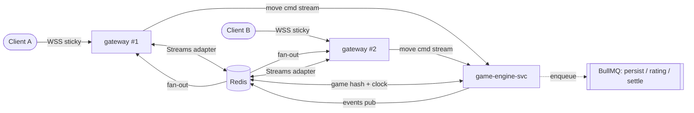
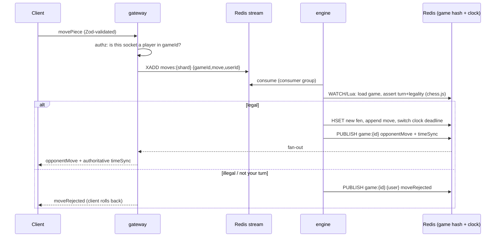
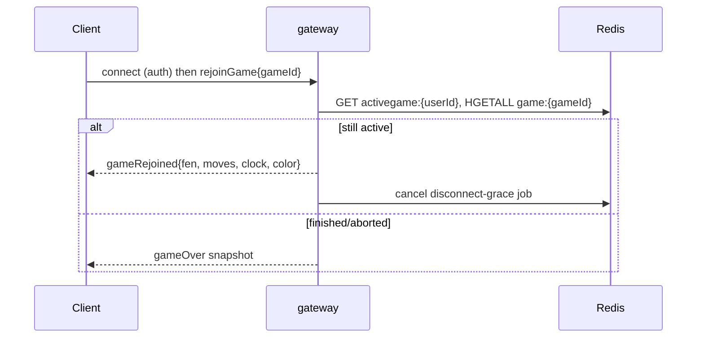

# 02 — Realtime Gameplay Architecture

> **Scope:** how live moves, clocks, presence, spectating, chat, and reconnection work across many
> instances. This is the core of the 10k-CCU rebuild. **Diagram:**
> [realtime-gameplay.drawio](../diagrams/realtime-gameplay.drawio). **Governing instructions:**
> [`.github/instructions/realtime.instructions.md`](../../.github/instructions/realtime.instructions.md).

---

## 1. What is wrong today

`server.mjs` runs the socket server, chess validation, clocks, DB writes and chain calls in **one
process**, with all live state in `Map`s (`userSocketMap`, `activeGames`, `gameTimers`,
`gameStateStore`). The Socket.IO Redis adapter is attached, but it only broadcasts *messages* between
instances — it does **not** share the `Map`s. So a second instance is blind to the first's games. That
is why "add another server" was impossible and why the single process fell over under light load.

## 2. Target: split transport from logic; keep all state in Redis



Two services, each independently scalable:

| Service | Does | Never does |
| --- | --- | --- |
| **realtime-gateway** | Accept WS connections, authenticate handshake, join/leave rooms, relay client commands to the engine (via a Redis stream), push engine events back to sockets, presence heartbeats | Validate chess moves, own clocks, write Postgres, call the chain |
| **game-engine-svc** | Validate & apply moves (chess.js), own the authoritative clock, detect end conditions, emit events, enqueue side-effects | Hold a socket, hold state in memory |

Why split: socket I/O needs *many light* instances near users; validation is *CPU-bound and bursty*.
Splitting stops a validation spike from stalling socket heartbeats (the monolith's failure mode) and
lets each tier autoscale on its own signal.

> **Pragmatic note:** the gateway and engine can ship as **one deployable** in phase 1 of the
> [migration](../delivery/02-migration-plan.md) as long as **all state is already in Redis** and the
> process is **stateless**. Splitting into two services is a config change once state is externalized.
> Externalizing state is the hard requirement; the process split is an optimization.

## 3. Load balancing & sticky sessions

Socket.IO's default transport upgrades HTTP→WebSocket and **requires the same instance for the
handshake**. Therefore:

- Enable **sticky sessions** at the load balancer (cookie- or IP-hash based).
- Use the **`@socket.io/redis-streams-adapter`** (preferred over the classic Pub/Sub adapter at this
  scale: bounded memory, backpressure, replayable) so any instance can deliver to a socket connected
  elsewhere.
- Set Socket.IO `connectionStateRecovery` so a brief network blip restores the session and missed
  events without a full rejoin.

```js
// gateway bootstrap (sketch)
import { createAdapter } from "@socket.io/redis-streams-adapter";
const io = new Server(httpServer, {
  transports: ["websocket"],                 // skip long-polling at scale
  connectionStateRecovery: { maxDisconnectionDuration: 2 * 60_000 },
  cors: { origin: ALLOWED_ORIGINS },          // NEVER "*" — see 11-security.md
});
io.adapter(createAdapter(redisClient));
```

## 4. Rooms & presence

- **Game room:** `game:{gameId}` — the two players. **Spectator room:** `spectators:{gameId}` (kept
  separate so a flood of spectators cannot affect players; already the pattern today).
- **Presence** lives in Redis, not a `Map`:
  - `HSET presence:{userId} socketId {id} gatewayId {gw} lastSeen {ts}` with TTL refreshed by
    heartbeat.
  - `SETEX activegame:{userId} …` → which game a user is in (enables reconnect resume).
- On disconnect the gateway does **not** forfeit immediately; it publishes a `disconnect` and the
  **scheduler** starts a Redis-backed grace timer (see §7). Reconnect within grace → resume.

## 5. Event contract (single source of truth)

Every event has a **Zod schema** in a shared package (`packages/contracts` or `lib/realtime/contracts.ts`)
imported by **both** client and gateway. No stringly-typed payloads. This is the primary defense
against four devs/LLMs inventing divergent shapes.

```ts
export const MovePiece = z.object({
  gameId: z.string().uuid(),
  from: z.string().regex(/^[a-h][1-8]$/),
  to: z.string().regex(/^[a-h][1-8]$/),
  promotion: z.enum(["q", "r", "b", "n"]).optional(),
  clientTs: z.number(),
});
export type MovePiece = z.infer<typeof MovePiece>;
```

Client → server commands (validated on arrival):

| Event | Payload | Handler |
| --- | --- | --- |
| `joinQueue` | mode, timeControl, rating, stake? | matchmaking |
| `movePiece` | gameId, from, to, promotion? | engine |
| `offerDraw` / `acceptDraw` / `declineDraw` | gameId | engine |
| `resign` | gameId | engine |
| `joinRoom` / `leaveRoom` | gameId | gateway |
| `joinSpectatorRoom` | gameId | gateway (rate-limited) |
| `requestRematch` / `respondRematch` | gameId, accept | engine |
| `chatMessage` | gameId, text | gateway (profanity-filtered via `obscenity`) |
| `ping` | ts | gateway (latency) |

Server → client events: `matchFound`, `opponentMove`, `timeSync`, `gameOver`, `drawOffered`,
`disconnectGraceState`, `gameRejoined`, `spectatorSnapshot`, `rematchRequested`, `error`.

**Rule:** adding or changing an event = update the Zod contract + this table + the
[frontend hook](./01-frontend.md#6-realtime-integration-pattern-the-one-true-way) in the same PR.

## 6. Move handling (authoritative)



Key points:

- **One writer per game.** Concurrency is controlled by a per-game lock (`SET NX`) or by sharding a
  game to a single engine consumer via the stream partition key = `gameId`. This prevents two moves
  racing the same board.
- Move validation uses **chess.js** loaded from the stored FEN + move list. The client's claimed FEN
  is **ignored** for truth (it is accepted only as a cross-check hint).
- The **clock** is recomputed from server timestamps (see [04-game-engine-state.md](./04-game-engine-state.md)).

## 7. Clocks, timeouts & disconnect grace (no per-process `setTimeout`)

The current code schedules everything with in-process `setTimeout` (`gameTimers`,
`firstMoveAbortTimers`, `gameDisconnectTimers`) — lost on deploy/restart and impossible to share.
Replace with a **Redis-backed scheduler**:

- Each turn writes an absolute **deadline** into the game hash and schedules a **BullMQ delayed job**
  `clock-timeout:{gameId}` for that deadline.
- A move for that game **removes/replaces** the pending job and schedules the opponent's.
- The **scheduler** service processes due jobs: on `clock-timeout` it flags the game as timed out and
  hands off to the engine to finalize (respecting insufficient-material draw rules already in
  `lib/timeout-material.mjs`).
- Same mechanism for `first-move-abort` and `disconnect-grace`. Because deadlines are absolute
  timestamps in Redis, a redeploy simply re-reads them — **no clock is ever lost**.

## 8. Reconnection & resume



Because the full game state is in Redis, resume works even if the client reconnects to a **different**
gateway instance — the whole point of externalizing state.

## 9. Spectators (protect players from spectator load)

- Spectators join `spectators:{gameId}` only; they receive a throttled `spectatorSnapshot` + move
  stream, never player-only events.
- Keep the existing **join rate-limit** (per-socket window) to blunt spectator floods.
- For very popular games, spectator fan-out can be delegated to a **read-only broadcast** (one engine
  publish → adapter fan-out) so player latency is unaffected regardless of spectator count.

## 10. Backpressure & abuse control

| Risk | Control |
| --- | --- |
| Move/event flooding | Per-socket token-bucket rate limit at the gateway (e.g. N events/sec); drop + warn over limit |
| Oversized payloads | `maxHttpBufferSize` tightened; Zod rejects malformed |
| Reconnect storms | Client backoff + jitter; gateway accept queue; `connectionStateRecovery` |
| Slow consumers | Redis Streams adapter applies backpressure; trim streams with `MAXLEN` |
| Zombie sockets | Heartbeat (`pingInterval`/`pingTimeout`) + presence TTL cleanup |

## 11. Scaling numbers

- ~**10,000 sockets per gateway instance** (2 vCPU / 2 GB, `transports: ["websocket"]`, tuned
  `ulimit`/`--max-old-space-size`). **2–3 instances** cover 10k CCU with HA headroom; **4–5** at 20k
  burst.
- Engine scales on **moves/sec**; 2 instances handle thousands of validations/sec.
- Redis is the shared hotspot — colocate in-region; use **Dragonfly** or Redis Cluster if a single
  node's ops/sec becomes the ceiling. See [07-data-layer.md](./07-data-layer.md) and
  [deployment/01-scaling-playbook.md](../deployment/01-scaling-playbook.md).

## 12. Definition of done (realtime)

- [ ] No authoritative state in process memory; kill any gateway/engine pod → games continue.
- [ ] All events Zod-validated against the shared contract; CORS locked to allowed origins.
- [ ] Clocks/timeouts/grace via Redis + scheduler, never `setTimeout` in a request handler.
- [ ] Reconnect to a *different* instance resumes the game from Redis.
- [ ] Load test: 10k sockets, 2.5k concurrent games, p95 move RTT < 120 ms in-region.
