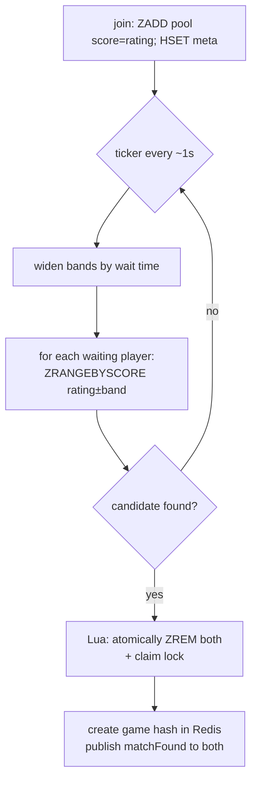

# 03 — Matchmaking Architecture

> **Scope:** how two players are paired — casual and staked. **Diagram:**
> [matchmaking.drawio](../diagrams/matchmaking.drawio).

---

## 1. What is wrong today

`lib/matchmaking.mjs` keeps the queues in **in-process arrays/maps** inside a closure
(`freeQueue`, `stakedQueue`). Matching is an **O(n²)** nested scan on every join. This is single-instance
only (a second gateway has its own empty queue) and degrades quadratically as the pool grows — a direct
contributor to the "couldn't handle a few dozen users" failure.

## 2. Target: Redis-backed pools + atomic pop

Model each pool as a **Redis Sorted Set**. Members are players; the score encodes priority. Matching is
a small **Lua script** that runs atomically inside Redis, so multiple `matchmaking-svc` instances can
pop safely without double-matching.

### Pool keys

| Pool | Key | Score | Member |
| --- | --- | --- | --- |
| Casual | `mm:casual:{tc}` (tc ∈ {1,2,3,10}) | player rating | `userId` |
| Staked | `mm:staked:{token}:{tc}` | player rating | `userId` |

Per-player metadata (socket, enqueue time, stake amount, on-chain game id, widening band) is stored in
`mm:meta:{userId}` (hash, short TTL). Keeping ratings as the score lets us pop **rating-close**
opponents by range query rather than scanning everyone.

## 3. Pairing algorithm (rating-banded, fair, fast)

Chess pairing should favor **similar ratings** but must not make players wait forever. Use a widening
band:

- On enqueue, record `enqueuedAt`, `rating`, and `band = BAND0` (e.g. ±100).
- A ticker (every ~1 s) **widens** each waiting player's band with age:
  `band = BAND0 + ceil(waitSeconds / STEP) * GROWTH` up to a cap (e.g. ±500), so lonely players
  eventually match anyone.
- To pair player `P`: `ZRANGEBYSCORE pool (P.rating-P.band) (P.rating+P.band)` → candidates; pick the
  **longest-waiting** compatible candidate (fairness), excluding self and same wallet.



### Atomic pop (why Lua)

The pop-two-and-remove step must be atomic or two `matchmaking-svc` instances could grab the same
player. A single Lua script does: re-check both members still present → `ZREM` both → return their meta.
If it returns nil (someone was already taken), the caller retries the next candidate. This replaces
the fragile in-memory splicing in today's code and is safe under horizontal scaling.

## 4. Staked matchmaking (money path)

Staked pairing is bucketed by **(token, timeControl)** and by **stake amount** — the effective stake is
`min(a, b)` of the two players (already the current rule). The extra step versus casual is on-chain
game setup:

```mermaid
sequenceDiagram
    participant MM as matchmaking-svc
    participant R as Redis
    participant GW as gateway
    participant P1 as Player 1 (creator)
    participant CH as Chessdict.sol
    MM->>R: pop two compatible staked players (Lua)
    MM->>R: create pending game (state=AWAITING_STAKE), lock
    MM->>GW: matchFound{stake, token, role}
    GW-->>P1: prompt createGameSingle(stake) + approve
    P1->>CH: approve + createGameSingle → onChainGameId
    P1->>GW: stakeCreated{onChainGameId}
    GW->>R: attach onChainGameId; ask Player 2 to join stake
    Note over R,GW: both confirmed within timeout → game starts;\n otherwise refund/cancel path (see 06)
```

- Use **Redis locks + state machine** (`AWAITING_STAKE → STAKE_READY → LIVE | CANCELLED`) instead of
  the tangle of `stakeTimeouts`, `stakeCreationTimeouts`, `stakeCreationFailureDelays` maps in
  `server.mjs`. The state and its deadline live in Redis; the **scheduler** fires the timeout.
- If either player fails to stake in time, the game is cancelled and the counterparty is refunded (see
  [06-blockchain-settlement.md](./06-blockchain-settlement.md)). No player is ever left paying alone.

## 5. Guarantees & edge cases

| Concern | Handling |
| --- | --- |
| Same wallet self-match (multi-tab) | Exclude same `userId`; on enqueue remove prior entries for that wallet (keep current behavior, but in Redis) |
| Double match under scale | Atomic Lua pop + per-player claim lock |
| Player disconnects while queued | Presence TTL expiry → ticker removes stale `userId` from pools |
| Starvation | Band widening with wait time; hard cap guarantees eventual match |
| Fairness within a band | Prefer longest-waiting candidate |
| Abuse (queue spam) | Rate-limit `joinQueue`; one active queue entry per wallet |

## 6. Service shape & scaling

- `matchmaking-svc` is stateless: it owns the ticker + Lua pop loop. Run **2 instances** for HA; the
  Lua atomicity makes concurrent poppers safe. Even a single instance handles thousands of
  pops/sec — the pool math is now `O(log n)` range queries, not `O(n²)` scans.
- Casual pools are independent per time control, so load naturally shards.

## 7. Testing

Keep and extend `__tests__/matchmaking.test.mjs`, but test the **Lua pop** against a real/embedded
Redis (e.g. `ioredis-mock` for unit, a Dockerized Redis for integration). Property test: no player is
ever matched twice; effective stake is always `min`.

## 8. Definition of done (matchmaking)

- [ ] Pools in Redis sorted sets; pop is a single atomic Lua script.
- [ ] Rating-band widening implemented with a wait cap.
- [ ] Staked flow modeled as a Redis state machine with scheduler-driven timeouts (no `setTimeout` maps).
- [ ] Two `matchmaking-svc` instances never double-match (integration test proves it).
