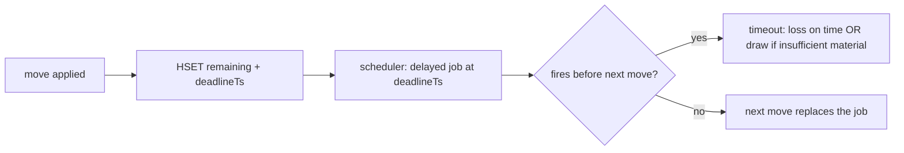

# 04 — Game Engine & Authoritative State

> **Scope:** the source of truth for a chess game — move legality, the clock, end conditions, and how
> a live game becomes a persisted record. **Diagram:**
> [game-engine-state.drawio](../diagrams/game-engine-state.drawio).

---

## 1. Principle: the server is the only truth

On a money game, clients cannot be trusted. The engine — not the browser — decides what is legal, whose
turn it is, how much time each side has, and how a game ends. The client's job is to render and to make
optimistic predictions that are always reconciled to server state.

The current code is *mostly* server-authoritative already (good), but the truth lives in process
`Map`s and in-process `setTimeout` clocks. We keep the authority, move the state to Redis, and move the
scheduling to a durable scheduler.

## 2. Live game state model (Redis)

One hash per game plus an append-only move list:

```
game:{id}  (HASH)
  status        WAITING|LIVE|COMPLETED|ABORTED|DRAW
  fen           <current FEN>            # authoritative position
  whiteId,blackId,turn
  timeControl   1|2|3|10                 # minutes
  whiteMs,blackMs                        # remaining clock (ms) at lastMoveTs
  lastMoveTs    <epoch ms>               # when the running clock last started
  deadlineTs    <epoch ms>               # absolute timeout for side-to-move
  moveCount, drawOfferBy, onChainGameId, stakeToken, wager
game:{id}:moves  (LIST of JSON)          # {from,to,san,promotion,ts}
```

Why a hash + list rather than one JSON blob: field-level updates (`HSET whiteMs …`) avoid read-modify-write
races and are cheaper than rewriting a big JSON string on every move.

### Concurrency: one writer per game

Two moves must never mutate the same board concurrently. Enforce with **either**:

- **Stream partitioning:** route all commands for a `gameId` to a single engine consumer (partition key
  = `gameId`), so writes for one game are naturally serialized; **or**
- **Per-game lock:** `SET lock:game:{id} {token} NX PX 2000` around the read-validate-write, executed as
  a **Lua script** so load→validate→store is atomic.

Prefer the Lua/lock approach for correctness; use stream partitioning to reduce contention.

## 3. Move validation flow

```mermaid
sequenceDiagram
    participant GW as gateway
    participant ENG as game-engine-svc
    participant R as Redis
    participant SCH as scheduler
    GW->>ENG: movePiece{gameId,from,to,promo,userId}
    ENG->>R: Lua begin: HGETALL game:{id} + moves
    ENG->>ENG: assert status=LIVE, userId==side-to-move
    ENG->>ENG: chess.load(fen); chess.move(...) legal?
    alt legal
      ENG->>ENG: compute elapsed = now - lastMoveTs; deduct from mover clock
      ENG->>R: HSET fen, turn, whiteMs/blackMs, lastMoveTs, deadlineTs; RPUSH move
      ENG->>SCH: schedule clock-timeout at deadlineTs (replace prior)
      ENG->>R: PUBLISH opponentMove + timeSync
      ENG->>ENG: end-condition? (mate/stalemate/insufficient/50-move/rep)
      opt game over
        ENG->>R: HSET status; enqueue persist+rating(+settle)
        ENG->>R: PUBLISH gameOver
      end
    else illegal or not your turn
      ENG->>R: PUBLISH moveRejected(userId)
    end
```

Legality, checkmate, stalemate, threefold repetition, fifty-move, and insufficient material all come
from **chess.js** — never reimplement chess rules. Promotion is validated (`q|r|b|n`), matching the
existing `chess-promotion` tests.

## 4. The clock (server-authoritative, deadline-based)

Never tick a clock with a per-request `setInterval`. Instead store **remaining time + a deadline** and
compute on read:

- On a move by the side to move: `remaining[mover] -= (now - lastMoveTs)` (+ increment if the time
  control has one). Then set `lastMoveTs = now` and `deadlineTs = now + remaining[opponent]`.
- Clients display time by counting down to `deadlineTs` locally; the periodic `timeSync` corrects
  drift. The **display** is derived from the server deadline, so it is impossible to gain time by
  lagging.
- Flag-fall is enforced by the **scheduler**: a BullMQ delayed job set for `deadlineTs`. If it fires
  before the next move, the side-to-move loses on time — unless the position is an insufficient-material
  draw, per `lib/timeout-material.mjs` (keep that logic; it is correct and tested in
  `__tests__/timeout-material.test.mjs`).



Because deadlines are absolute timestamps in Redis, a deploy or crash loses **no** clock — on restart
the scheduler simply re-reads pending deadlines. This directly fixes the "games hang / clocks drift"
class of bugs.

## 5. First-move abort & disconnect grace

Same durable mechanism, different deadlines (values kept from current code):

| Timer | Trigger | Deadline | On fire |
| --- | --- | --- | --- |
| First-move abort | game start, no first move | bullet 15 s / blitz 20 s / rapid 60 s | abort game, no rating change |
| Disconnect grace | a player disconnects | 30 s (regular) | forfeit if not reconnected |
| Stake setup/confirm | staked match created | 45–90 s | cancel + refund (see [06](./06-blockchain-settlement.md)) |

All are BullMQ delayed jobs keyed by `gameId`, cancelled/replaced on the relevant event. The
`recentlyCompletedGames` guard (to avoid false disconnect-forfeits right after a game ends) becomes a
short-TTL Redis key `completed:{gameId}`.

## 6. Game end → durable record

When the engine detects an end condition it does **not** block the hot path on DB/chain work. It:

1. `HSET status`, write result reason, compute PGN/final FEN (reuse the existing
   `buildReplayArtifactsFromMoveRecords` logic — move it into the engine service).
2. Enqueue **persist** (write the `Game` row + moves), **rating** (Glicko-2), and, if staked,
   **settlement**. Each is an idempotent BullMQ job keyed by `gameId`.
3. `PUBLISH gameOver` so both clients update instantly.

The Redis game hash keeps a short TTL after completion so late reconnects still get the result, then
expires; Postgres is the permanent record.

## 7. Anti-cheat & integrity

| Vector | Mitigation |
| --- | --- |
| Illegal/forged moves | Server validates every move against stored FEN with chess.js; client FEN ignored for truth |
| Clock manipulation via lag | Time derived from server deadlines, not client-reported elapsed |
| Playing two boards as one wallet | One active game per wallet (`activegame:{userId}` in Redis) |
| Move injection for another player | Gateway authz: socket must be a player in `gameId`; engine re-checks side-to-move |
| Result forgery (staked) | Only the engine can enqueue settlement; settlement worker verifies game record before paying |
| Engine assistance (bots) | Out of scope v1; log move-time distributions for later detection |

## 8. Testing

The existing pure-logic tests (`chess-promotion`, `material-balance`, `timeout-material`,
`game-result-display`, `player-ratings`, `premove`, `time-control`) are exactly the right kind — keep
them and run them against the extracted engine module. Add:

- **Property tests:** replaying a move list always reproduces the same FEN; clock never goes negative;
  sum of both clocks + elapsed is conserved.
- **Concurrency test:** two simultaneous `movePiece` for the same game → exactly one applied.

## 9. Definition of done (engine)

- [ ] Truth (FEN, turn, clocks) in Redis; no `Map`-based game state.
- [ ] Move apply is atomic (Lua/lock); concurrency test passes.
- [ ] Clocks/timeouts via scheduler deadlines; survive redeploy with zero lost clocks.
- [ ] Game end enqueues persist/rating/settlement idempotently; hot path stays fast.
