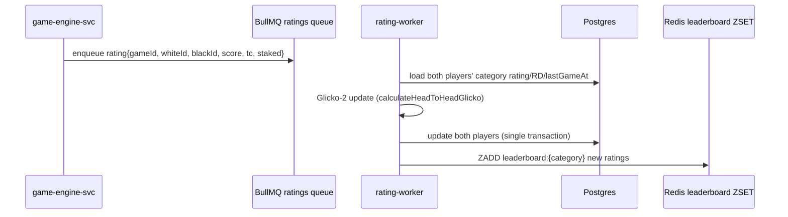

# 05 — Rating System (Glicko-2)

> **Scope:** how player skill is measured and displayed. Keep the existing Glicko approach; make
> updates asynchronous and leaderboards cheap to read.

---

## 1. Why Glicko-2 (keep it)

Elo assumes every player plays constantly. A staking chess app has sparse, spiky play, so **Glicko-2**
is the right choice — it tracks a **rating (r)**, a **rating deviation (RD)** = uncertainty, and a
**volatility (σ)**. The current code already implements the head-to-head update
(`lib/glicko-rating.mjs`) and stores per-category fields. We keep the math and fix *where* and *when* it
runs.

## 2. Rating categories (keep the current split)

Ratings are per **time control** plus a separate **staked** rating, matching the schema:

| Category | Field | Time control |
| --- | --- | --- |
| Bullet | `bulletRating` (+ RD, lastGameAt) | ≤ 2 min |
| Blitz | `blitzRating` (also mirrored to `rating`) | 3–5 min |
| Rapid | `rapidRating` | ≥ 10 min |
| Staked | `stakedRating` | any staked game |

Each category carries its own `…RatingDeviation` and `…RatingLastGameAt`, which Glicko-2 needs to inflate
RD for inactivity. Keep this.

## 3. Where it runs: `rating-worker`, not the hot path

Today `updateRatings()` runs inline in `server.mjs` at game end with **four sequential Prisma calls**
(two reads, two writes). Under load that blocks the event loop that is also serving sockets. Move it to
the **rating-worker**:

- The job is **idempotent** keyed by `gameId` (a `RatingApplied` marker or a unique constraint prevents
  double-applying if the job retries).
- Use a **transaction** for the two-player write so a crash can't update only one side.
- Update a **Redis sorted set** `leaderboard:{category}` in the same step so leaderboard reads are
  `O(log n)` and never hit Postgres on the hot read path.

## 4. Leaderboard reads

- Serve `/leaderboard` from `ZREVRANGE leaderboard:{category} 0 N WITHSCORES` (Redis) with the player's
  rank via `ZREVRANK`. Cache the rendered page/segment in the CDN for a short TTL.
- Postgres remains the source of truth; the ZSET is a derived read model rebuilt on demand from a
  periodic job or on write. This keeps leaderboard traffic off the primary DB even at 10k CCU.

## 5. Edge cases (preserve current behavior)

| Case | Rule |
| --- | --- |
| Draw | score = 0.5 for white |
| New player | RD starts at 350 (high uncertainty → fast early movement) |
| Inactivity | RD inflates with time since `…LastGameAt` (Glicko-2 handles this) |
| Blitz mirror | `blitzRating` also writes `rating` (keep for backward compatibility) |
| Aborted / first-move-abort games | **no** rating change |
| Staked games | update `stakedRating` category regardless of time control |

## 6. Testing

Keep `__tests__/glicko-rating.test.mjs`, `player-ratings.test.mjs`, and `leaderboard.test.mjs`. Add an
idempotency test (same `gameId` applied twice changes ratings once) and a transaction-atomicity test.

## 7. Definition of done (ratings)

- [ ] Rating updates run in `rating-worker`, never inline in the socket/engine hot path.
- [ ] Two-player update is a single idempotent transaction keyed by `gameId`.
- [ ] Leaderboards served from a Redis sorted set, not a live DB scan.
