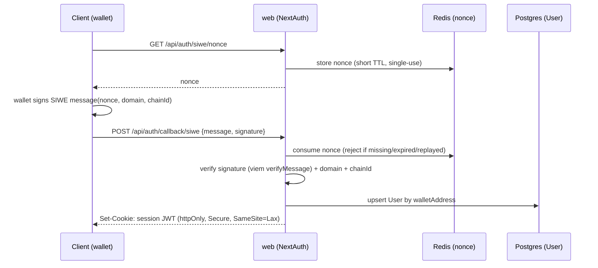

# 08 — Auth & Identity

> **Scope:** how a wallet becomes an authenticated session, and how that identity flows through the
> stateless services. **Governing instructions:**
> [`.github/instructions/security.instructions.md`](../../.github/instructions/security.instructions.md).

---

## 1. Model: wallet-first, stateless sessions

`walletAddress` is the primary identity (per the team's existing principle). Login is **Sign-In With
Ethereum (SIWE, EIP-4361)**: the user proves control of their wallet by signing a nonce; the server
issues a **stateless JWT session**. GitHub OAuth remains an optional social attach.

Stateless (JWT) sessions matter for scale: any `web` or `realtime-gateway` instance can verify a
session without a shared session store lookup on the hot path.

## 2. Flow

Keep **NextAuth v5** with the Prisma adapter for account/session models and the OAuth path; add a SIWE
**Credentials provider** for the wallet path. Nonces are single-use and stored in Redis with a short
TTL to prevent replay.

## 3. Session verification across services

- **web**: NextAuth middleware verifies the JWT on protected routes/server actions.
- **realtime-gateway**: verify the **same JWT** during the Socket.IO handshake
  (`io.use(authMiddleware)`), extracting `userId`/`walletAddress`. The current code trusts a `userId`
  query param on the socket — that is spoofable and must be replaced by verifying the signed session
  token. This is both a security fix and required for the anti-cheat guarantees in
  [04](./04-game-engine-state.md#7-anti-cheat--integrity).
- Short-lived access token + refresh, or a rotating session cookie; the gateway re-checks expiry on
  reconnect.

## 4. Authorization

| Action | Rule |
| --- | --- |
| Make a move | Socket's authenticated `userId` must be a player in `game:{id}` |
| Accept challenge / rematch | Session identity must match the invited wallet |
| Admin / tournament control | Role claim (`role: admin|td`) in the session; checked server-side |
| Staked actions | Session wallet must equal the on-chain `msg.sender` for that game |

Never trust a `userId`/`walletAddress` sent in an event body — always derive it from the verified
session on the server.

## 5. Middleware & route protection

Keep `src/middleware.ts` for route gating, but make it verify JWT claims (not just presence) and attach
a typed session. Protected server actions re-check authorization server-side (defense in depth — never
rely on the client having hidden a button).

## 6. Secrets

- `AUTH_SECRET`, OAuth client secrets, RPC keys, and the redeemer key live in the platform's **secrets
  manager**, never in the repo or `NEXT_PUBLIC_*`. Only truly public values may be `NEXT_PUBLIC_*`
  (they are inlined into the client bundle at build time — see the Dockerfile args).
- Rotate `AUTH_SECRET` and OAuth secrets on a schedule; rotation invalidates old JWTs (acceptable).

## 7. Definition of done (auth)

- [ ] SIWE login issues a stateless JWT session; nonces are single-use in Redis.
- [ ] Socket.IO handshake verifies the session token — no trusting a client-supplied `userId`.
- [ ] Every mutating action re-derives identity from the session and authorizes server-side.
- [ ] All secrets in a secrets manager; only public values are `NEXT_PUBLIC_*`.
