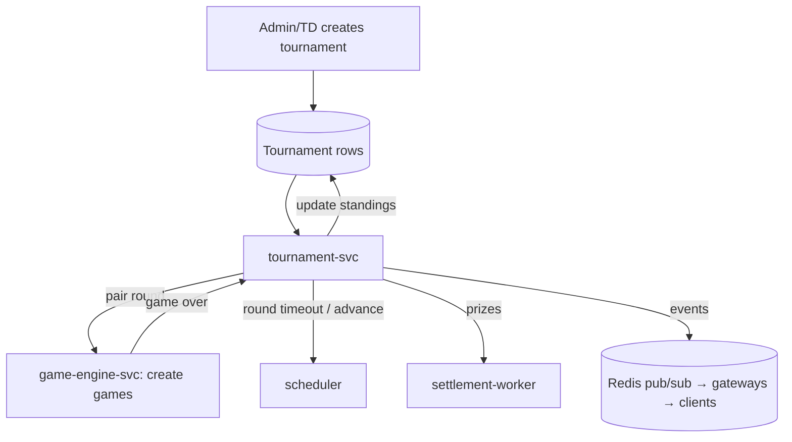

# 09 — Tournaments

> **Scope:** running multi-player events (brackets and round-robin), on top of the same game engine.

---

## 1. Model (keep the schema)

The Prisma models `Tournament`, `TournamentParticipant`, `TournamentMatch` already express the domain:
status lifecycle, rounds, per-round matches, points/wins/draws/losses, on-chain fields
(`onChainGameId`, `token`, sponsorship). Keep them. The rebuild moves the **orchestration** out of
`server.mjs` into a dedicated `tournament-svc`.

## 2. Why a dedicated service

Tournament orchestration is stateful *coordination* (who plays whom next round, when a round times out,
when to advance) that today lives in `server.mjs`'s in-memory maps and `setTimeout`s (the same
anti-pattern as game clocks). It becomes a `tournament-svc` whose state is in Postgres and whose timers
are scheduler jobs.

## 3. Formats & algorithms

| Format | Pairing algorithm | Advance rule |
| --- | --- | --- |
| Single elimination | seed bracket; winners advance | lose once → eliminated |
| Round robin | circle method (round-robin scheduling); everyone plays everyone | points: win 1, draw 0.5 |
| Swiss (future) | pair on running score, avoid rematches | fixed number of rounds |

Bracket/seed generation and round-robin scheduling are **pure functions** — put them in
`tournament-svc/lib/` and unit-test them exhaustively (this is textbook DS&A: pairing graphs, seeding).

## 4. Round lifecycle

1. `tournament-svc` computes the round's matches (pure pairing fn) and writes `TournamentMatch` rows.
2. For each match it asks the engine to create a game (reusing the normal live-game machinery — a
   tournament game is a normal game with a `tournamentMatchId`).
3. It schedules a **round timeout** (scheduler job). Unfinished matches at timeout are adjudicated per
   rules (e.g. current position result or forfeit) — keep the existing forfeit-countdown UX.
4. On every `gameOver`, it records the result, updates standings, and checks whether the round is
   complete → advance or finish.
5. On finish, it computes placements and, for staked/sponsored tournaments, enqueues **prize
   settlement** via the settlement worker (same durable path as 1v1, see [06](./06-blockchain-settlement.md)).

## 5. Realtime tournament events

Reuse the gateway + Redis pub/sub. Tournament rooms (`tournament:{id}`) receive `tournament:starting`,
`roundStart`, `standings`, `gameStart`, `bye`, `roundComplete`, `forfeitCountdown`, `complete` — the
existing event set, but published from `tournament-svc` through Redis rather than emitted from an
in-memory loop. Payloads join the shared Zod contract.

## 6. Scaling

Tournaments are modest in number relative to casual games; a single `tournament-svc` (with an HA
standby, leader-elected so only one drives a given tournament) handles many concurrent events. The
heavy lifting (the actual games) rides the already-scaled engine/gateway tiers.

## 7. Definition of done (tournaments)

- [ ] Orchestration in `tournament-svc`; state in Postgres; timers in the scheduler (no `setTimeout`).
- [ ] Pairing/seeding are pure, unit-tested functions.
- [ ] Tournament games reuse the standard engine; results flow back via `gameOver`.
- [ ] Prize payouts go through the settlement worker (durable, idempotent).
