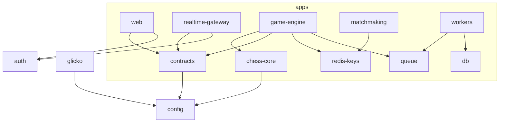

# Target Repository Structure

> **Scope:** the folder layout the rebuild targets. A **monorepo** so shared contracts/types are
> single-sourced (the fix for four devs inventing divergent shapes), with clear service boundaries.

---

## 1. Why a monorepo

The #1 cause of spaghetti was **no shared contract** between the client, the socket server, and the
workers. A monorepo with a `packages/contracts` shared by everything makes divergence a compile error,
not a runtime surprise. Tooling: **npm workspaces + Turborepo** (caching, task orchestration).

## 2. Layout

```
chessdict/
├─ docs/                        # THIS plan (architecture, deployment, delivery, diagrams)
├─ .github/
│  ├─ copilot-instructions.md   # always-on LLM guardrails (points to docs/)
│  ├─ instructions/*.instructions.md
│  ├─ agents/*.agent.md
│  └─ workflows/*.yml           # CI/CD
├─ AGENTS.md                    # cross-tool guide (Cursor/Claude/Codex)
├─ .claude/skills/…             # Claude skill mirroring the architecture
│
├─ apps/
│  ├─ web/                      # Next.js 16 App Router (UI + REST route handlers + server actions)
│  │  └─ src/
│  │     ├─ app/                # routes only (thin)
│  │     ├─ features/           # feature-first modules (see 01-frontend.md)
│  │     ├─ components/ui/      # shared Radix/shadcn primitives
│  │     ├─ lib/{api,chain,realtime}/
│  │     ├─ hooks/  stores/
│  │     └─ middleware.ts  auth.ts
│  ├─ realtime-gateway/         # Socket.IO transport service (stateless)
│  ├─ game-engine/              # move validation + authoritative clock
│  ├─ matchmaking/              # Redis-pool matchmaking
│  ├─ scheduler/                # clock/timeout/grace/expiry jobs
│  └─ workers/
│     ├─ rating/  persistence/  notify/  settlement/  tournament/
│
├─ packages/
│  ├─ contracts/                # ⭐ shared Zod schemas + TS types for ALL socket/REST events
│  ├─ chess-core/               # pure chess logic wrappers over chess.js (validate, PGN, material)
│  ├─ glicko/                   # Glicko-2 (from lib/glicko-rating.mjs, typed + tested)
│  ├─ redis-keys/               # the key catalog as typed builders (game(id), presence(id)…)
│  ├─ queue/                    # BullMQ setup, job types, idempotency helpers
│  ├─ db/                       # Prisma schema, client singleton, migrations
│  ├─ auth/                     # SIWE + NextAuth config shared by web + gateway
│  ├─ observability/            # OTel/pino setup, health endpoints
│  └─ config/                   # env loading + Zod validation, shared tsconfig/eslint
│
├─ chessdict-contracts/         # Foundry Solidity (keep as-is)
│
├─ load-tests/                  # today's stress-test/ suite, extended (k6/artillery + socket scenarios)
├─ turbo.json  package.json  tsconfig.base.json  .env.example (per app)
```

## 3. Dependency rules (enforced)



- **Apps never import from other apps.** They only import from `packages/*`.
- **`packages/contracts` is the only place event shapes are defined.** Client and server both import it.
- **Pure logic lives in packages** (`chess-core`, `glicko`, `redis-keys`) — unit-tested in isolation,
  reused everywhere. This is where the current `lib/*.mjs` and `__tests__/*.mjs` migrate to.
- **No cyclic deps** (enforced by `eslint-plugin-import` / Turborepo graph).

## 4. What maps where (from today's code)

| Today | Moves to |
| --- | --- |
| `server.mjs` (God file) | split across `apps/realtime-gateway`, `apps/game-engine`, `apps/matchmaking`, `apps/scheduler`, `apps/workers/*` |
| `lib/matchmaking.mjs` | `apps/matchmaking` + `packages/redis-keys` |
| `lib/glicko-rating.mjs` | `packages/glicko` |
| `lib/timeout-material.mjs`, chess helpers | `packages/chess-core` |
| `lib/redis.mjs` | `packages/redis-keys` + per-app Redis clients |
| `lib/chessdict-abi-server.mjs`, `src/lib/chessdict-abi.ts` | `packages/contracts` (ABI) + `apps/workers/settlement` |
| `src/**` (Next app) | `apps/web/src/**` (feature-first) |
| `prisma/**` | `packages/db` |
| `__tests__/**` | co-located with the package/app they test |
| `stress-test/**` | `load-tests/` |

## 5. Standards baked into the repo

- One `tsconfig.base.json` (strict) extended everywhere; one ESLint/Prettier config in
  `packages/config`.
- `.env.example` per app; env validated with Zod at boot (`packages/config`) — fail fast on missing
  vars.
- Conventional commits + changesets for versioning shared packages.

## 6. Definition of done (structure)

- [ ] Monorepo with `apps/*` + `packages/*`; apps import only from packages.
- [ ] `packages/contracts` is the single source of event/DTO shapes.
- [ ] Current `lib/*` pure logic relocated into tested packages.
- [ ] Turborepo task graph builds/tests only what changed.
