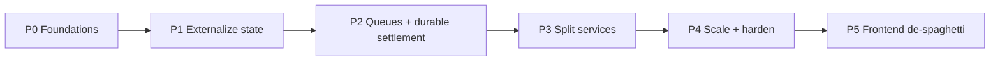

# Migration Plan

> **Scope:** how to get from today's monolith to the target architecture **without a risky big-bang
> rewrite and without a feature freeze**. The ordering is deliberate: fix the things that unblock
> scaling first.

---

## 1. Strategy: strangler-fig, state-first

You asked to "rebuild." The safest rebuild is **incremental replacement** (the *strangler-fig*
pattern), not a from-scratch rewrite that ships nothing for months. The key insight:

> **90% of the scaling win comes from externalizing state and moving slow work to queues — which you
> can do *inside* the current process before splitting anything into separate services.**

So we sequence the work to bank the scalability gains early, then refactor structure for
maintainability. Rewrite the *product* if you want a clean codebase, but reuse the **proven domain
logic** (chess rules, Glicko, timeout-material, the contract) — it's tested and correct; the problem
was always *where state and work lived*, not the chess math.

## 2. Phases

### Phase 0 — Foundations (no behavior change)
- Stand up the monorepo skeleton ([00-target-repo-structure.md](./00-target-repo-structure.md)),
  Turborepo, strict TS, ESLint/Prettier, CI ([03-cicd.md](../deployment/03-cicd.md)).
- Extract pure logic into packages **with their existing tests**: `packages/glicko`
  (`lib/glicko-rating.mjs`), `packages/chess-core` (`lib/timeout-material.mjs` + chess helpers),
  `packages/redis-keys` (key catalog), `packages/contracts` (start the Zod event schemas from the
  current socket payloads).
- Add observability + health endpoints ([10](../architecture/10-observability.md)). Lock CORS; verify
  the socket session instead of trusting `userId` ([08](../architecture/08-auth-identity.md)).
- **Outcome:** same app, now measurable, typed, and testable. Zero user-visible change.

### Phase 1 — Externalize state (the unblock) ⭐
- Replace every authoritative `Map`/`Set` in `server.mjs` with Redis via `packages/redis-keys`:
  presence, active game, game state, matchmaking pools, locks. (The app *already* uses Redis for some
  of this — finish the job so **nothing authoritative is in memory**.)
- Move matchmaking to **Redis sorted sets + Lua pop** ([03](../architecture/03-matchmaking.md)).
- Replace in-process `setTimeout` clocks/timeouts with **Redis deadlines + a scheduler loop** (can run
  in-process initially) ([04](../architecture/04-game-engine-state.md#4-the-clock-server-authoritative-deadline-based)).
- **Gate:** run 2 instances behind a sticky LB with the Redis Streams adapter; a game started on
  instance A survives if A is killed (client resumes on B). **This is the moment the app can scale
  horizontally.**

### Phase 2 — Queues + durable settlement (the money fix)
- Introduce **BullMQ**. Move rating updates, game persistence, and notifications off the hot path into
  idempotent workers ([05](../architecture/05-ratings.md)).
- Replace fire-and-forget `settleStakedGame` with the **outbox + settlement-worker** (idempotent,
  nonce-serialized, retrying) and add reconciliation
  ([06](../architecture/06-blockchain-settlement.md)). Isolate the redeemer key.
- **Gate:** kill the RPC mid-settlement in staging → payout completes on retry; a duplicate job never
  double-pays.

### Phase 3 — Split services (structure for scale + team)
- Carve the now-stateless process into deployables: `realtime-gateway`, `game-engine`, `matchmaking`,
  `scheduler`, `workers/*`, keeping `apps/web` for UI ([00-target-repo-structure.md](./00-target-repo-structure.md)).
- Because state is already external and the code is already in packages, this is mostly **moving
  modules and adding entrypoints**, not rewriting logic.
- **Gate:** each service scales independently; contract-drift CI check is green.

### Phase 4 — Scale & harden
- Autoscaling policies, Redis sizing/Dragonfly, read replicas + pooler, security headers, rate limits.
- Run the load-test gates to **10k then 20k CCU** ([01-scaling-playbook.md](../deployment/01-scaling-playbook.md#5-capacity-checkpoints-prove-it-before-you-need-it)).

### Phase 5 — Frontend de-spaghetti (parallelizable from P0)
- Break up `game-board.tsx` (2,022 lines) and siblings per
  [01-frontend.md](../architecture/01-frontend.md): extract clock/move-list/controls, move all
  `socket.on` into hooks, adopt the three-state model. Can run in parallel with backend phases since it
  only depends on the shared `packages/contracts`.

## 3. Sequencing & ownership (4+ devs, no collisions)

The monorepo + service split lets people own lanes instead of fighting over `server.mjs`:

| Lane | Owner | Docs |
| --- | --- | --- |
| Realtime + engine + scheduler | Dev A | 02, 04 |
| Matchmaking + tournaments | Dev B | 03, 09 |
| Settlement + contract + data | Dev C | 06, 07 |
| Frontend + contracts package | Dev D | 01, 00-struct |
| Platform: CI/CD, deploy, observability | rotating | deployment/*, 10, 11 |

Each lane maps to a package/app boundary, so PRs rarely touch the same files — directly addressing the
"everyone edits the same spaghetti" problem.

## 4. Data migration

- The Prisma schema is largely reused; add `SettlementOutbox` and idempotency markers via
  expand/contract migrations ([07](../architecture/07-data-layer.md#25-migrations--safety)).
- No destructive migrations during rollout; backfill in the background; keep old columns until the new
  code is fully live.

## 5. Rollback & safety per phase

- Every phase ships behind the ability to **run old and new side by side** (feature flags / parallel
  deploy) and roll back to the prior image.
- Phase 1 and 2 are validated with **chaos tests** (kill a pod, kill Redis, kill RPC) in staging before
  prod.
- Keep the legacy `server.mjs` runnable until Phase 3's services pass their gates, then retire it.

## 6. Definition of done (migration)

- [ ] Phase 1 gate passed: 2 instances, no game lost when one dies — app scales horizontally.
- [ ] Phase 2 gate passed: settlement is durable, idempotent, reconciled.
- [ ] Services split along package boundaries; devs own non-overlapping lanes.
- [ ] Load gates to 10k/20k CCU green; legacy `server.mjs` retired.
