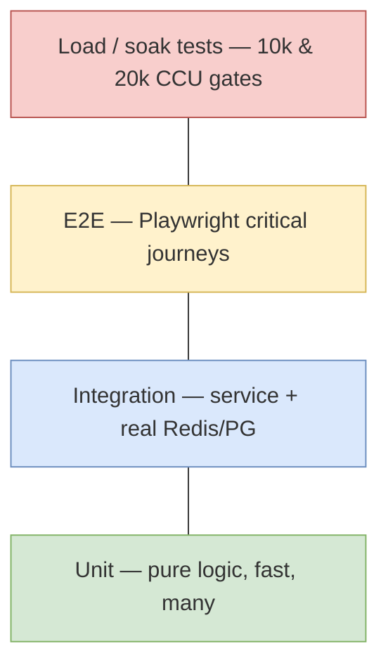

# Testing Strategy

> **Scope:** how we prove correctness and capacity. The first build had good *unit* tests but no way to
> catch the scaling failure — this strategy adds the layers that would have.

---

## 1. The test pyramid (+ load layer)

| Layer | Tool | Scope | Speed / count |
| --- | --- | --- | --- |
| Unit | **Vitest** | Pure functions: chess-core, glicko, matchmaking pairing, clock math, board-math | ms, hundreds |
| Integration | **Vitest + Testcontainers** (real Redis + Postgres) | A service against real backing stores: Lua pop, engine apply, settlement idempotency | seconds |
| E2E | **Playwright** | Full journeys through the UI | minutes |
| Load | **k6 / Artillery + socket.io-client** (extend `stress-test/`) | Capacity + soak | scheduled |
| Contract | **Foundry** | `Chessdict.sol` invariants + reverts | seconds |

## 2. Keep & relocate current tests

The existing `__tests__/*.mjs` are exactly the right kind of fast, pure tests — keep every one, move
each next to the package it now lives in:

| Test | New home |
| --- | --- |
| `glicko-rating.test.mjs`, `player-ratings.test.mjs` | `packages/glicko` |
| `chess-promotion`, `material-balance`, `timeout-material`, `game-result-display`, `time-control` | `packages/chess-core` |
| `matchmaking.test.mjs` | `apps/matchmaking` (+ integration vs real Redis for Lua pop) |
| `premove.test.mjs` | `apps/web` feature/gameplay |
| `leaderboard.test.mjs` | `packages/glicko` / `apps/web` |

## 3. What each critical area must test

### Game engine (highest risk)
- **Property tests:** replay a move list → deterministic FEN; clock never negative; time is conserved
  (both clocks + elapsed).
- **Concurrency test (integration):** two simultaneous `movePiece` for one game → exactly one applied
  (proves the Lua/lock).
- All end conditions: mate, stalemate, threefold, fifty-move, insufficient material, flag-fall,
  insufficient-material-on-timeout draw.

### Matchmaking
- No player matched twice; effective stake = `min`; rating-band widening eventually matches; two
  `matchmaking-svc` instances never double-match (integration vs real Redis).

### Settlement (money — zero tolerance)
- Idempotency: same `gameId` job twice → one payout.
- Retry: RPC throws N times → eventually settles; stuck tx → fee-bump path.
- Reconciliation: a `PENDING` outbox row with no tx → re-enqueued.
- Foundry: double `setWinnerSingle` reverts; refund/cancel paths; malicious ERC20; access control.

### Realtime
- Reconnect to a **different** gateway instance resumes the game from Redis.
- Rate limiting drops floods (mirror `stress-test/03`, `04`).
- Auth handshake rejects an invalid/absent session token.

### Frontend
- Hooks and pure `lib/` logic unit-tested; board renders only changed squares; optimistic move reconciles
  to server truth and rolls back on rejection.

## 4. Load & soak testing (the missing layer)

Extend `stress-test/` into `load-tests/` and run against staging:

| Scenario | Based on | Target |
| --- | --- | --- |
| Connection ramp | `01-connections` | 10k → 20k sockets, watch fd/CPU |
| Gameplay | `02-gameplay` | 2.5k concurrent games, p95 move < 120 ms |
| Event flood | `03-event-flood` | rate-limits hold; no crash |
| Reconnect storm | `04-reconnect-storm` | backoff+jitter; no thundering herd |
| Spectators | `05-spectators` | player latency unaffected by spectator count |
| Full load / soak | `06-full-load` | 10k CCU for 1–2 h; no leak, flat latency |
| Chaos | new | kill gateway+engine+Redis failover mid-load → games survive |

Wire Grafana dashboards to every run ([10](../architecture/10-observability.md)) so the **bottleneck is
visible**, not guessed. These are **release gates** in CI/CD, not afterthoughts.

## 5. Test data & environments

- Testcontainers spin up ephemeral Redis + Postgres for integration tests (no shared state, no
  flakiness).
- Neon branches give per-PR real Postgres for E2E ([03-cicd.md](../deployment/03-cicd.md#4-environments)).
- Seed deterministic fixtures; never test against production data.

## 6. Coverage & gates

- Coverage tracked per package; **changed files must not decrease coverage**.
- Core money/engine packages target high coverage (>90%); UI pragmatic.
- CI blocks merge on any red layer (unit/integration/contract) + lint + types; load/E2E gate releases.

## 7. Definition of done (testing)

- [ ] Pure logic unit-tested in packages; engine/matchmaking/settlement have integration tests vs real
  Redis/PG.
- [ ] Playwright covers connect→queue→play→result and the staking flow.
- [ ] Load gates to 10k & 20k CCU wired as release gates with dashboards.
- [ ] Chaos test proves pod/Redis-failover loses no games.
