# Engineering Workflow

> **Scope:** how the team works day to day so 4+ engineers (and their different LLMs) produce
> **consistent** code. This is the human process; the [LLM guides](../../.github) are its automated
> enforcement.

---

## 1. The root problem this solves

> "Everyone pulls latest and works as they see fit, with different LLMs and no shared context, so the
> code has no clear pattern."

The fix is three-part: **(1)** a shared, machine-readable architecture (this `docs/` tree), **(2)** LLM
guides that force every assistant to read it, and **(3)** a lightweight process that keeps lanes
separate and PRs small.

## 2. Branching & commits

- **Trunk-based**: short-lived branches off `main`, merged within ~1–2 days. No long-running forks that
  drift.
- Branch names: `type/scope-short-desc` (e.g. `feat/matchmaking-lua-pop`).
- **Conventional Commits** (`feat:`, `fix:`, `refactor:`, `docs:`, `test:`, `chore:`). Enables
  changelogs + changesets for `packages/*` versioning.
- One logical change per PR; keep them **small and reviewable** (< ~400 lines diff where possible).

## 3. Ownership lanes (avoid collisions)

Use the lanes from the [migration plan](./02-migration-plan.md#3-sequencing--ownership-4-devs-no-collisions).
Because each lane maps to a package/app boundary, two people rarely edit the same file. `CODEOWNERS`
routes reviews to the lane owner.

## 4. The PR lifecycle

```mermaid
graph LR
    A[Read the relevant docs/ page] --> B[Small branch]
    B --> C[Implement to standards + tests]
    C --> D[Self-review with pr-reviewer agent]
    D --> E[Open PR — template + checklist]
    E --> F[CI gates: lint/types/test/contract/security]
    F --> G[Human review by lane owner]
    G --> H[Squash-merge]
    H --> I[Auto-deploy staging → gated prod]
```

### PR must include
- Link to the `docs/` architecture page it implements/changes.
- The **Definition of Done** checklist from the relevant doc, ticked.
- Tests for new logic; updated docs+diagram if the design changed.
- Screenshots/loom for UI; load-test note if it touches a hot path.

### Definition of Ready (before starting)
- The task references a specific doc; unknowns resolved (ask, don't guess a second pattern).
- Contract changes (events/DTOs) designed in `packages/contracts` first.

## 5. Working with LLMs consistently (the core ask)

Every engineer, regardless of tool, gets the **same context** because it's committed to the repo:

| Tool | Reads automatically |
| --- | --- |
| GitHub Copilot (VS Code) | [`.github/copilot-instructions.md`](../../.github/copilot-instructions.md) + `*.instructions.md` (by `applyTo`) + `*.agent.md` |
| Cursor | `.cursorrules` (kept) + `AGENTS.md` |
| Claude / Claude Code | [`AGENTS.md`](../../AGENTS.md) + [`.claude/skills/`](../../.claude/skills) |
| Codex / others | [`AGENTS.md`](../../AGENTS.md) |

Rules for LLM-assisted work:
1. **Point the assistant at the relevant `docs/` page first** (the guides do this automatically, but
   verify).
2. **Never accept code that violates the "don't do this" list**
   ([coding-standards §11](./01-coding-standards.md#11-quick-dont-do-this-list-the-exact-things-that-caused-the-mess))
   — no in-memory game state, no `setTimeout` clocks, no raw `socket.on` in components, no
   fire-and-forget settlement.
3. **Contracts first:** have the LLM add the Zod schema to `packages/contracts` before wiring an event.
4. **Review LLM output like a junior's PR** — run it, test it, check it against the doc.

## 6. Definition of Done (shared, every PR)

- [ ] Implements the relevant `docs/` page; no new pattern invented.
- [ ] Coding standards met (strict TS, no `any`, Zod boundaries, no app→app imports).
- [ ] No process-memory state, no game-logic `setTimeout`, no raw `socket.on` in components, no
  fire-and-forget money ops.
- [ ] Tests added; lint/types/tests/contract/security green.
- [ ] Docs + diagram updated if architecture changed; DoD checklist ticked.

## 7. Cadence

- **Daily**: async standup (the `chronicle` skill can generate one from session history).
- **Weekly**: architecture sync — any change to `docs/` reviewed here; keep docs and reality in lockstep.
- **Per release**: load-gate + changelog + retro on any incident.

## 8. Onboarding a new engineer (or LLM)

1. Read [docs/README.md](../README.md) → [00-system-overview.md](../architecture/00-system-overview.md).
2. Read the doc for their lane + [coding-standards](./01-coding-standards.md).
3. Skim the diagrams in [`docs/diagrams/`](../diagrams).
4. Their assistant already has the guides loaded — first task is a small, well-scoped lane change.

Target: a new contributor ships a correct, on-pattern PR on day one because the pattern is written
down and enforced.
