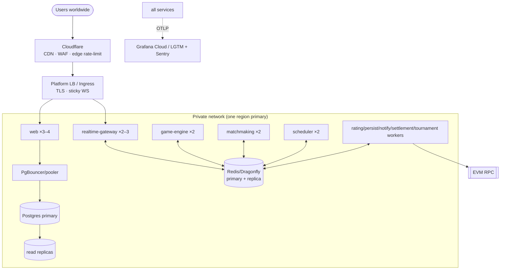

# Deployment Guide

> **Scope:** where to run Chessdict, how it's wired, and how to ship it. Read with
> [01-scaling-playbook.md](./01-scaling-playbook.md) and [02-cost-model.md](./02-cost-model.md).
> **Diagram:** [deployment-topology.drawio](../diagrams/deployment-topology.drawio).
> **Target: 10,000 CCU minimum, 20,000 burst.**

---

## 1. Platform decision

The workload has an unusual constraint for a Next.js app: **long-lived WebSockets with sticky
sessions**. Serverless-only platforms (plain Vercel functions) do not host stateful WS well. So the
realtime tier needs a **container platform that keeps processes alive and supports sticky routing**.

### Recommendation (cost-effective, ships fast)

| Component | Primary choice | Why | Alternative |
| --- | --- | --- | --- |
| Containers (all services) | **Fly.io** | Runs Docker close to users in many regions, native sticky WS, cheap, scales to N machines per service, private networking to Redis/PG | **Railway** or **Render** (simplest DX) |
| Managed Postgres | **Neon** | Serverless, autoscaling, branching, built-in pooler, generous pricing | **Supabase** |
| Managed Redis | **Upstash** (start) → **Dragonfly Cloud** or self-hosted Dragonfly (scale) | Pay-per-use to begin; move to dedicated multi-threaded node when ops/sec climbs | **ElastiCache** on AWS |
| CDN / static | **Cloudflare** (or the platform's built-in CDN) | Cache `_next/static`, images; WAF/rate-limit at edge | Fastly |
| Object storage (assets, PGN exports) | **Cloudflare R2** / **S3** | Cheap, egress-friendly (R2) | Backblaze B2 |
| Secrets | Platform secrets + **KMS** for the redeemer key | Key isolation ([06](../architecture/06-blockchain-settlement.md)) | Doppler/Vault |
| Observability | **Grafana Cloud** free tier or self-host LGTM + **Sentry** | Cheap, vendor-neutral | Datadog (pricier) |
| RPC | **Alchemy**/**Infura** (paid tier) | Reliable, higher rate limits for settlement | QuickNode |

**Why not "just Vercel"?** Use Vercel/Cloudflare for the **static/CDN/edge** layer if you like, but the
**realtime-gateway and workers must run as long-lived containers** (Fly/Railway/Render/ECS). A common
split: Cloudflare in front, `web` + realtime + workers on Fly.io, data on Neon + Upstash.

### Scale-up path (if you outgrow the PaaS)

**AWS ECS Fargate** (or EKS) behind an **ALB/NLB** with sticky target groups, **ElastiCache**
(Redis/Dragonfly), **RDS/Aurora Postgres**, **Secrets Manager + KMS**. Same architecture, more control
and higher ceiling. Kubernetes only if you have the ops maturity — it is not required for 10–20k CCU.

## 2. Topology

See [deployment-topology.drawio](../diagrams/deployment-topology.drawio) for the annotated version.

## 3. Regions & latency

- **Pick one primary region** near your largest user base and colocate **all** services + Redis + the
  Postgres primary there. In-region round trips keep move latency < 120 ms.
- Redis and the app **must** be in the same region/VPC — cross-region Redis kills latency.
- Put **static/CDN at the edge** globally (Cloudflare). Only the realtime tier needs to be regional.
- Multi-region *active-active* for live games is hard (shared Redis) — **do not** attempt it for v1.
  Instead, scale the single region and add read-replica regions for read-only pages later.

## 4. Containers & processes

Ship each service as its own image/target (they can share one repo/monorepo — see
[delivery/00-target-repo-structure.md](../delivery/00-target-repo-structure.md)). The current single
Dockerfile becomes **multiple start targets** or **multiple small Dockerfiles**:

| Service | Command | Replicas @10k | CPU/RAM each |
| --- | --- | --- | --- |
| web | `next start` (custom server only if needed) | 3–4 | 1 vCPU / 1 GB |
| realtime-gateway | `node gateway.mjs` | 2–3 | 2 vCPU / 2 GB |
| game-engine | `node engine.mjs` | 2 | 2 vCPU / 2 GB |
| matchmaking | `node matchmaking.mjs` | 2 | 1 vCPU / 512 MB |
| scheduler | `node scheduler.mjs` | 2 (HA) | 1 vCPU / 512 MB |
| workers (each) | `node worker-*.mjs` | 2 | 1 vCPU / 512 MB–1 GB |

- Set `NODE_OPTIONS=--max-old-space-size` appropriately; raise file-descriptor limits on the gateway
  (many sockets).
- **Graceful shutdown:** on SIGTERM, stop accepting new connections, flush, let clients reconnect
  elsewhere (state is in Redis, so this is safe). Drain period ~30 s.

## 5. Configuration & secrets

- 12-factor: all config via env; no secrets in the image. `NEXT_PUBLIC_*` only for genuinely public
  values (they are inlined into the client bundle — see current Dockerfile build args).
- Redeemer key → KMS/secrets manager, injected **only** into `settlement-worker`.
- One `.env.example` per service documenting required vars.

## 6. Zero-downtime releases

- **Migrations as a release step:** run `prisma migrate deploy` **once** in the CI/CD pipeline (a
  dedicated release job), not on every container boot — otherwise N replicas race. Use expand/contract
  migrations ([07](../architecture/07-data-layer.md#25-migrations--safety)).
- **Rolling deploys** with health-gated cutover (`/readyz`). Because game state is in Redis, a rolling
  restart drops zero games — clients reconnect and resync.
- **Blue/green or canary** for the gateway/engine when changing the event contract.

## 7. Backups & DR

- Postgres: automated daily backups + PITR (Neon/RDS provide this); test restores quarterly.
- Redis: AOF + managed snapshots on the state/queue instance ([07](../architecture/07-data-layer.md#33-memory--durability-policy)).
- Settlement outbox in Postgres is the DR anchor for money — a full Redis loss still reconciles payouts.
- Document RTO/RPO; keep infra as code (Terraform/Fly config) so the stack is reproducible.

## 8. Definition of done (deployment)

- [ ] Realtime tier on a container platform with sticky WS; static/CDN at the edge.
- [ ] All services + Redis + Postgres primary colocated in one region.
- [ ] Pooler in front of Postgres; secrets in a manager; redeemer key only in the worker.
- [ ] Migrations run as a release job; rolling deploys drop zero games.
- [ ] Backups + reconciliation verified; infra reproducible from code.
