# CI/CD Pipeline

> **Scope:** how code goes from a PR to production safely and repeatably. This is also a consistency
> lever — the pipeline **enforces** the standards that four devs + different LLMs would otherwise drift
> from.

---

## 1. Principles

- **Every merge is releasable.** Trunk-based development with short-lived branches.
- **The pipeline is the gate, not the reviewer's memory.** Lint, types, tests, security, and build all
  run automatically; red = no merge.
- **Reproducible artifacts.** Build once, promote the same image dev → staging → prod.

## 2. Tooling

| Stage | Tool |
| --- | --- |
| CI runner | **GitHub Actions** (or GitLab CI) |
| Package manager | npm (lockfile committed) — matches current repo |
| Lint | ESLint (`eslint-config-next`) + Prettier |
| Types | `tsc --noEmit` (strict) |
| Unit/integration | **Vitest** (matches current `__tests__/`) |
| Contracts | **Foundry** (`forge test`, `forge fmt --check`) |
| E2E | **Playwright** |
| Load (scheduled/pre-release) | existing `stress-test/` suite |
| Security | Dependabot/Renovate, `npm audit`, gitleaks, Trivy (images), Slither (contracts) |
| Build | Docker multi-stage (extend current Dockerfile per service) |
| Deploy | Fly.io/Railway CLI or ECS deploy action |
| Migrations | `prisma migrate deploy` as a dedicated release job |

## 3. Pipeline stages

```mermaid
graph LR
    PR[PR opened] --> L[lint + typecheck]
    L --> UT[unit + integration - Vitest]
    UT --> CT[contracts - forge test + slither]
    CT --> SEC[security - audit, gitleaks, trivy]
    SEC --> BUILD[build images per service]
    BUILD --> E2E[Playwright E2E on ephemeral env]
    E2E --> MERGE{merge to main}
    MERGE --> STG[deploy staging + smoke]
    STG --> MIG[release job: prisma migrate deploy]
    MIG --> PROD[rolling deploy prod - health-gated]
    PROD --> POST[post-deploy checks + canary metrics]
```

### Required PR checks (block merge)

- ESLint + Prettier clean; `tsc` passes with **no `any`** regressions.
- Vitest green (unit + integration); coverage not decreased on changed files.
- Foundry tests green if `chessdict-contracts/**` changed.
- No secrets (gitleaks); no new high/critical CVEs (audit/Trivy).
- **Event-contract check:** if a realtime event or Zod schema changed, the shared contract + docs must
  be updated (a CI script greps for drift — see [02-realtime-gameplay.md](../architecture/02-realtime-gameplay.md#event-contract)).
- At least one human review.

## 4. Environments

| Env | Purpose | Data |
| --- | --- | --- |
| Preview (per-PR) | Ephemeral; Playwright runs here | throwaway DB (Neon branch) + throwaway Redis |
| Staging | Pre-prod mirror; smoke + load gates | anonymized/seeded |
| Production | Live | real |

**Neon branching** gives each PR a real Postgres branch cheaply; tear down on merge.

## 5. Migrations in CI/CD (do this correctly)

- Run `prisma migrate deploy` **once** in a release job **before** the new version takes traffic — never
  on container boot when running many replicas (they'd race). This changes the current
  `CMD ["sh","-c","prisma migrate deploy && node server.mjs"]` pattern.
- Enforce **expand/contract** migrations so the old and new app versions both work during the rollout
  ([07](../architecture/07-data-layer.md#25-migrations--safety)).
- Contract deploys (Foundry) are a **separate, gated pipeline** with explicit approval — never
  auto-deploy a contract change.

## 6. Release strategy

- **Rolling** deploys with `/readyz` gating; because state is in Redis, restarts drop zero games.
- **Canary** the gateway/engine when the event contract changes (route a small % first, watch move
  latency + error rate, then ramp).
- **Fast rollback:** keep the previous image; roll back on canary regression automatically.

## 7. Secrets in CI

- Secrets from the platform's encrypted store / OIDC to the cloud — never in workflow YAML.
- The **redeemer key is never in CI**; contract deploys use a separate, tightly controlled signer.

## 8. Definition of done (CI/CD)

- [ ] PRs blocked unless lint, types, tests, contracts, and security pass.
- [ ] Event-contract drift check enforced in CI.
- [ ] Migrations run as a gated release job with expand/contract discipline.
- [ ] Rolling/canary deploys with automatic rollback; per-PR preview envs.
